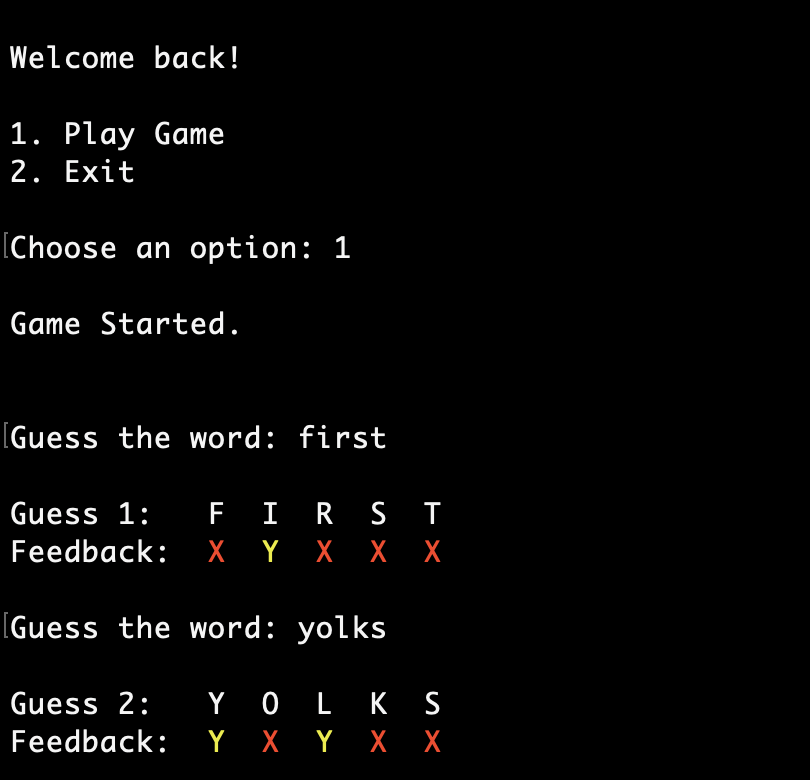
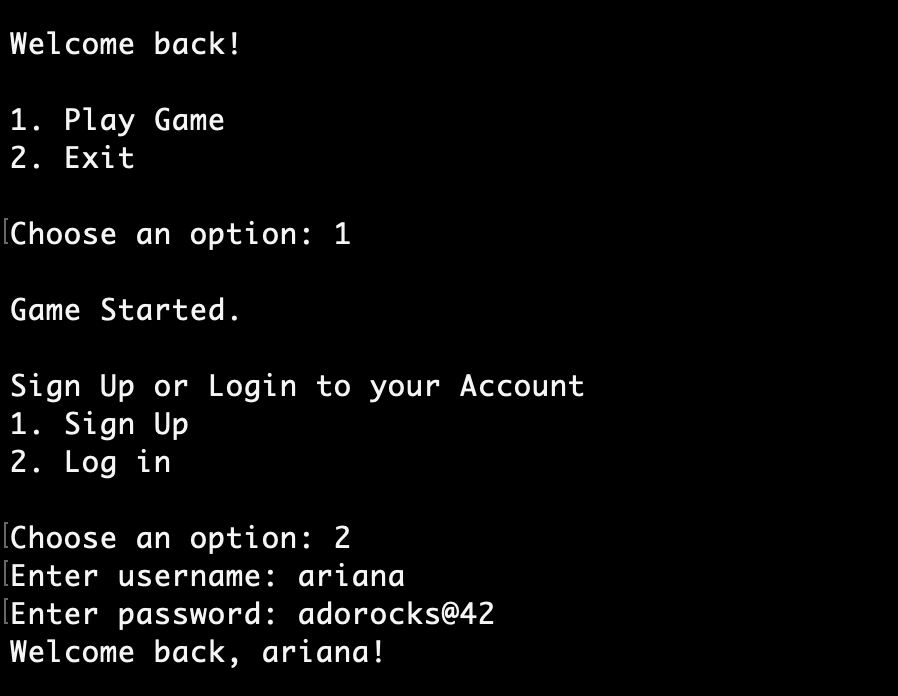
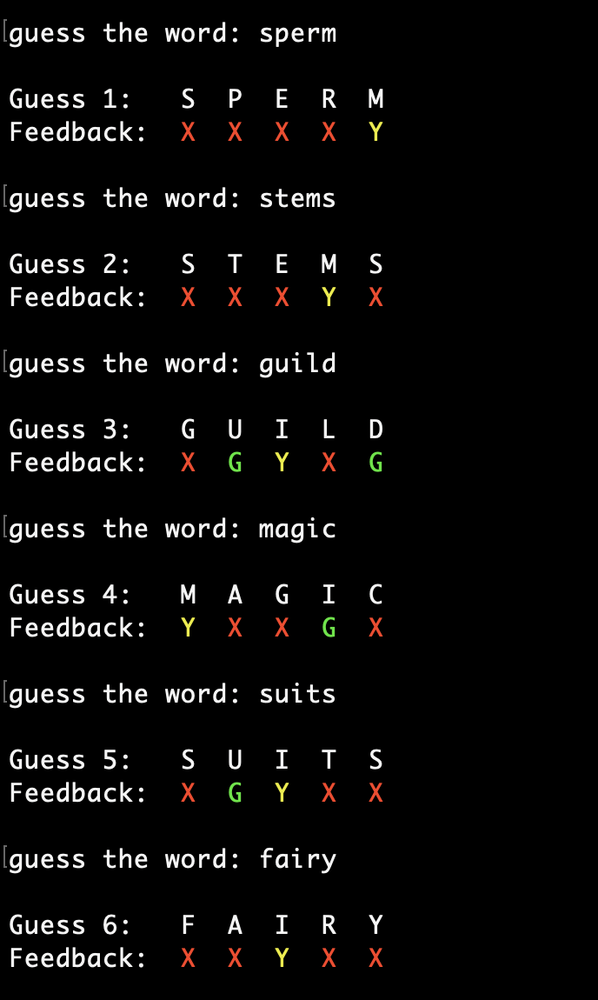
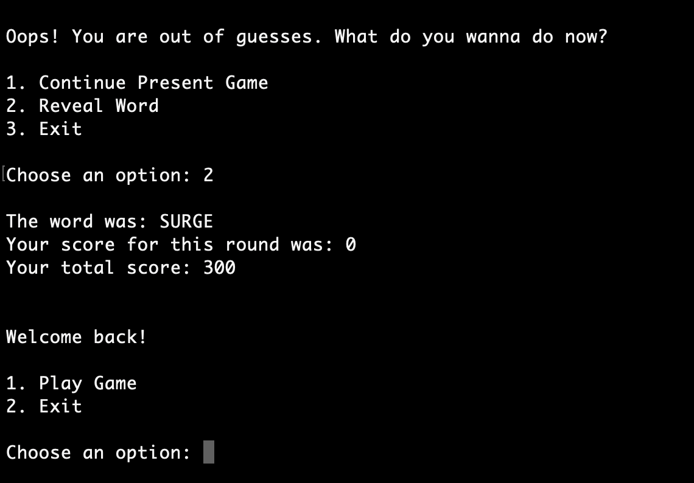

## Load the words onto database

```bash

CREATE TABLE words (
    id SERIAL PRIMARY KEY,
    word VARCHAR(5)
);
```

```bash
\copy words(word) FROM 'words.txt' WITH (FORMAT csv)
```

verify:
```bash
SELECT * FROM words LIMIT 5;
```

create `users` and `sessions` table:

```bash
CREATE TABLE users (
    userid SERIAL PRIMARY KEY,
    username VARCHAR(20),
    password VARCHAR(20),
    createdat TIMESTAMP
);

CREATE TABLE sessions (
    sessionid SERIAL PRIMARY KEY,
    userid INT REFERENCES users(userid),
    score INT,
    playedat TIMESTAMP
);
```

```bash
dotnet add package Npgsql --version 8.0.9
```

## Results <br><br>




### DB Integration Results<br><br>





